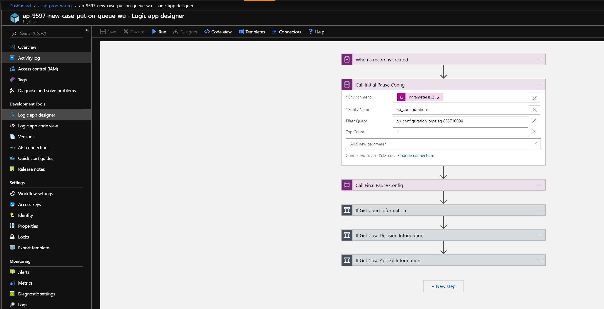
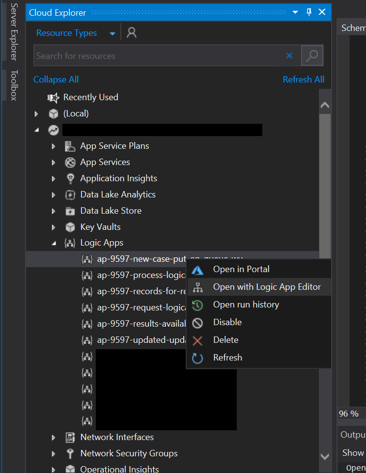
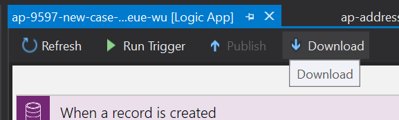
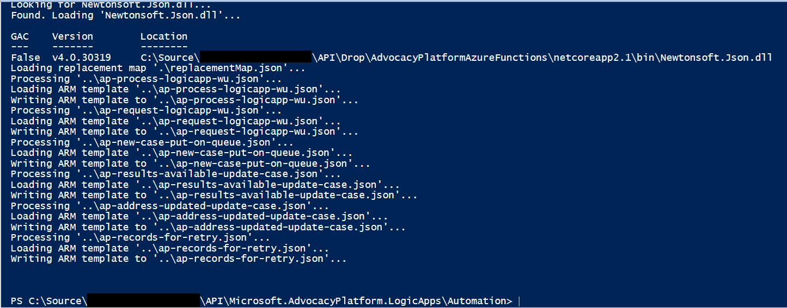

# Logic Apps

## Developing Changes
Logic app changes should be developed in the visual designer via the Azure Portal.



## Integrating Changes
To integrate changes, the following actions needed to be performed:

1. Open the *Microsoft.AdvocacyPlatform.API* solution.
2. Open *Cloud Explorer* in Visual Studio.
3. Download the modified Logic App definition and overwrite the existing file.

<br />
<br />



4. After all Logic Apps with changes have been downloaded open a new PowerShell terminal and navigate to the following directory:

```
{localRepositoryDirectory}\API\Microsoft.AdvocacyPlatform.LogicApps\Automation
```

5. The exported definitions are not necessarily parameterized in the same way as when they were deployed. Run the following command to ensure the Logic App definitions are parameterized as needed by the Advocacy Platform installer:

```ps
.\Integrate-LogicApps.ps1
```



Please refer to [Configuring Logic Apps Integration](./configuring-logic-apps-integration.md) for more information on how this process works.

6. Finally, we need to integrate these changes into the ARM templates used by the Advocacy Platform installer. Simply open the *AdvocacyPlatformInstaller* solution and build the *AdvocacyPlatformInstaller* project.

## Testing Changes
To verify changes integrated into the deployment ARM templates are valid run all unit tests in the *AdvocacyPlatformInstaller.FunctionalTests* project.

*Note: Currently, this does not detect all potential issues.*

## Checking in Changes
Please refer to the [Checking in Changes](../contributing/checking-in-changes.md) guide for more information on the preferred process for integrating changes.