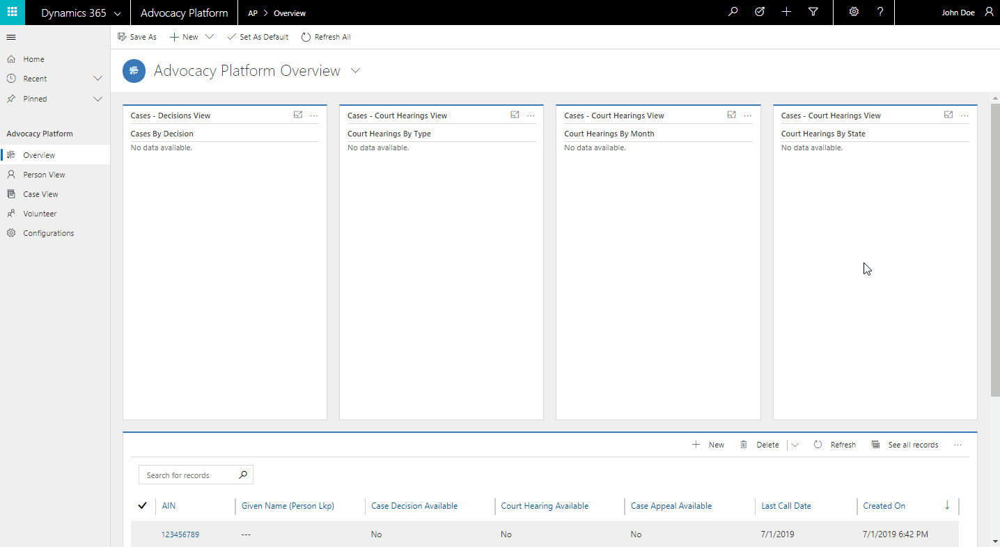
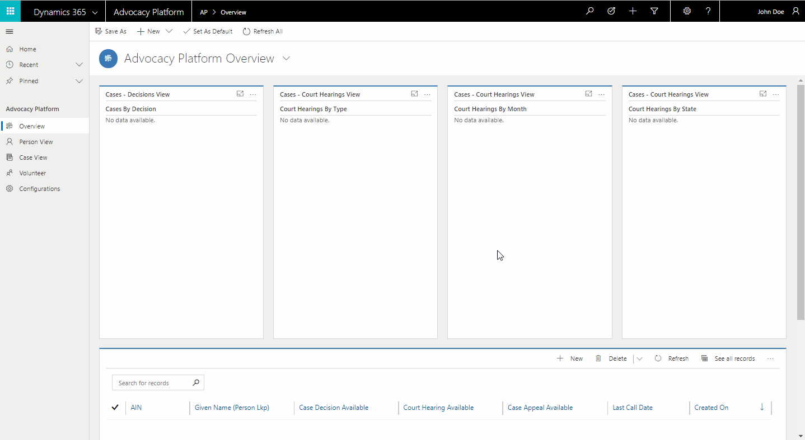
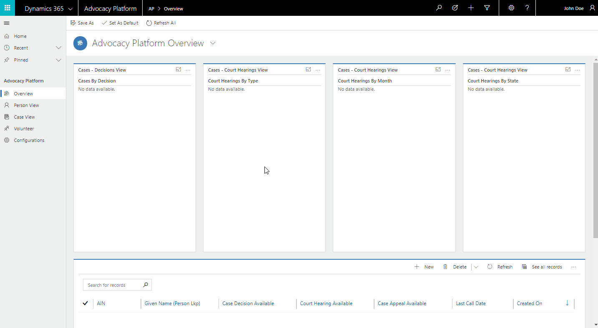
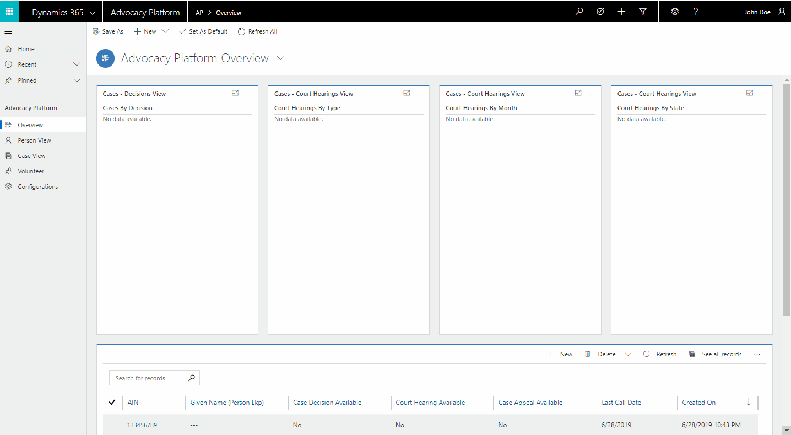
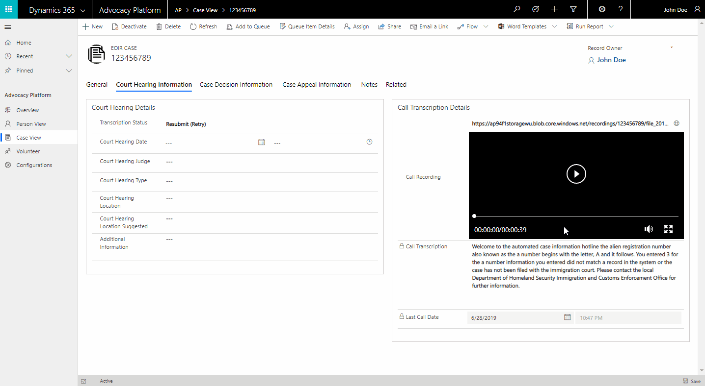

# Advocacy Platform How To Guide

# Table of Contents
1. [Add User Permissions](#Add-User-Permissions)
2. [Add New Single Case](#Add-New-Single-Case)
3. [Batch Upload](#Batch-Upload)
4. [View Case Details](#View-Case-Details)
5. [Download Recording](#Download-Recording)

## Add User Permissions

## Add New Single Case

## Batch Upload

## View Case Details

## Download Recording

