# Modify an Existing Installation

**_Note:_** To view additional information regarding ongoing operations at any time click on the checkbox next to **Show Details** in the lower left corner.

### I. Dependencies
#### Checking for Dependencies
In order to connect to and interact with the required Microsoft services, the installer needs to have consent for the indicated API permissions granted for the application in your tenant. One of the actions taken by the installer, registering the Function App application with Azure AD, needs an API permission requiring tenant administrator consent. If you are not a tenant administrator please forward the link on this page to your tenant administrator and ask for the application to be granted consent for the indicated API permissions. If you have not granted consent to this application before, click on *this link* in the description to open a browser frame in the installer and response appropriately to the prompts.

If you have previously granted consent, click on the **Next** button and continue to [Feature Selection](#II.-Feature-Selection)

 
 

Click on the **Accept** button.

The wizard should automatically navigate to the next screen. If you encounter any issues, share the resulting error message with your tenant administrator.

### II. Feature Selection

The **Feature Selection** page describes the components to update during the update process. Click on the **Next** button to continue.

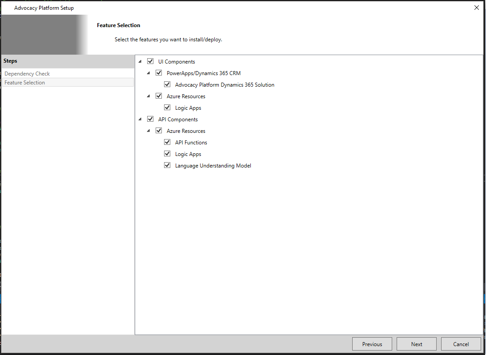

### III. Dynamics 365 CRM Solution Updates
The necessary information needed to make updates to the Dynamics 365 CRM solution should reflect the values from your loaded installation configuration. Review the configuration values specified below, make any changes necessary, and click on the **Next** button to begin updating the Dynamics 365 CRM solution.

#### Configuration
|Configuration Value|Description|
|-|-|
|Deployment Region|The deployment region for the new Dynamics 365 CRM organization.|
|Organization Name|The unique name of the organization.|
|Package Directory|The local file path to the updated Advocacy Platform Dynamics 365 CRM solution package. You shouldn't have to change this.|

 
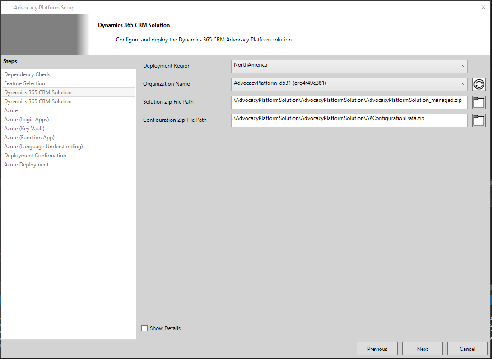

#### Deployment
The installer will deploy the specified Dynamics 365 CRM solution. As soon as the deployment has completed the installer will automatically navigate to the next page.

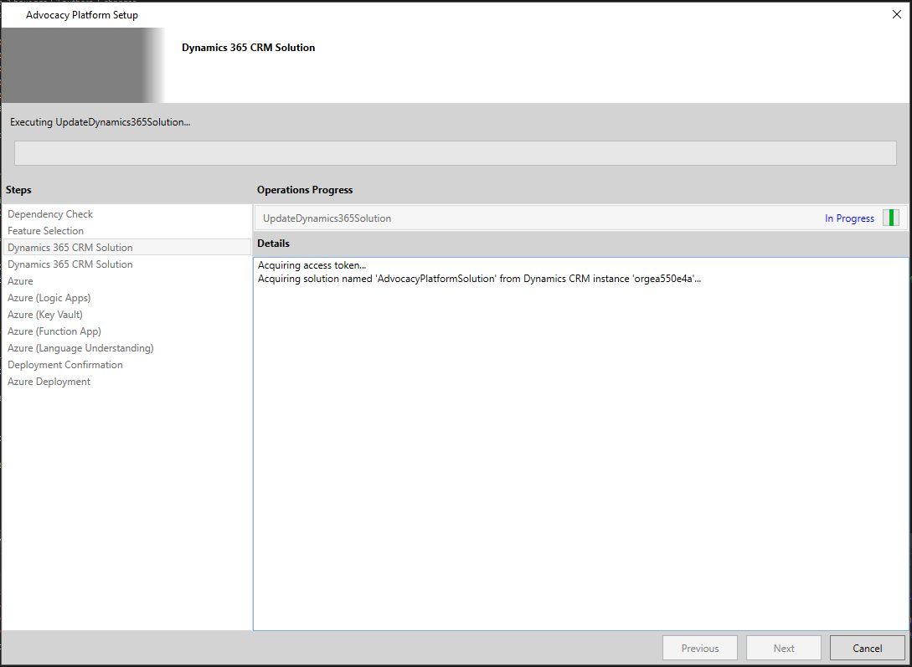

### V. Azure Resources
The necessary information needed to make updates to existing or new Azure resources required by the Advocacy Platform solution should reflect the values from your loaded installation configuration. Review the configuration values specified below, make any changes necessary, and click on the **Next** button to continue.

#### Configuration
|Configuration Value|Description|
|-|-|
|Subscription|The Azure subscription to deploy resources to.|
|Resource Group Name|The name of the Azure resource group to update resources in.|
|Storage Account Name|The name of the Azure Storage Account resource to update.|
Service Bus Name|The name of the Azure Service Bus resource to update.|
|Speech Resource Name|The name of the Azure Speech Cognitive Services resource to update.|
|Log Analytics Name|The name of the Azure Log Analytics resource to update.|
|App Insights Name|The name of the Azure Application Insights resource to update.|

 
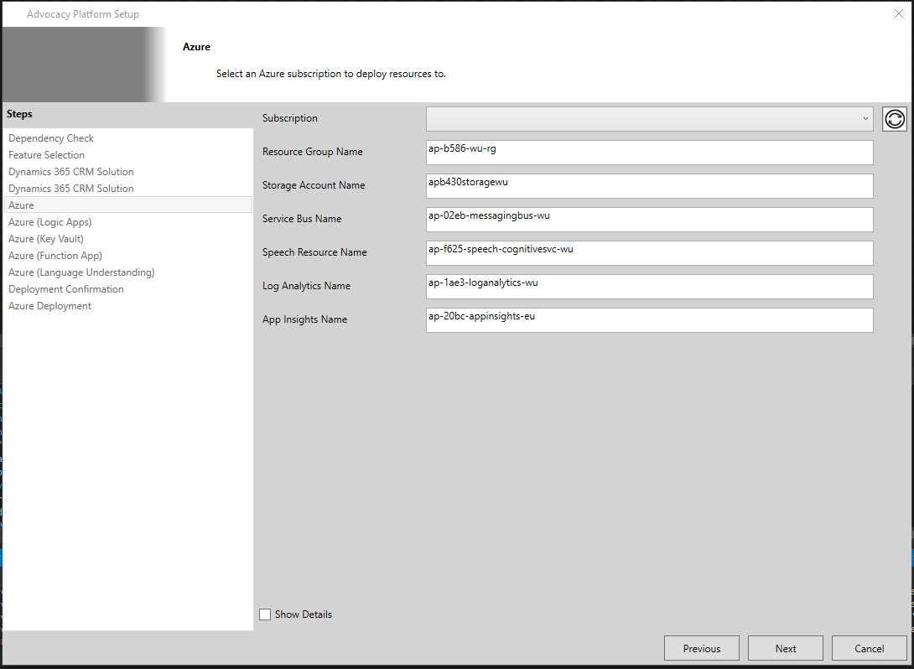

### VI. Azure Logic Apps
The necessary information needed to make updates to the Azure Logic Apps required by the Advocacy Platform solution should reflect the values from your loaded installation configuration. Review the configuration values specified below, make any changes necessary, and click on the **Next** button to continue.

#### Configuration
|Configuration Value|Description|
|-|-|
|Bing Maps API Key|The API key from your Bing Maps account needed to allow the Bing Maps data connector to resolve address queries.|
|Service Bus Connection Name|The name of the Azure Service Bus data connection resource to create to allow logic apps to read and write messages to and from the service bus resource.|
|Common Data Service Connection Name|The name of the Common Data Services data connection resource to create to allow logic apps to read and write data to and from the Common Data Service database.|
|Request Workflow Name|The name of the Azure Logic Apps resource to create to handle request messages.|
|Process Workflow Name|The name of the Azure Logic Apps resource to create to handle processing messages.|
|New Case Workflow Name|The name of the Azure Logic Apps resource to create to handle when new cases are created in Dynamics 365 CRM.|
|Results Update Case Workflow Name|The name of the Azure Logic Apps resource to create to handle when process complete and case results should be updated.|
|Address Update Case Workflow Name|The name of the Azure Logic Apps resource to create to handle when address resolution from Bing Maps completes and case results should be updated.|
|Get Retry Records Workflow Name|The name of the Azure Logic Apps resource to create to handle the retry strategy for failures within the process.|

 

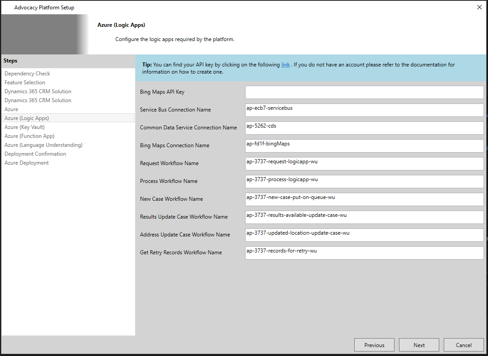

### VII. Azure Key Vault Secrets
The necessary information needed to make updates to the Azure Key Vault required by the Advocacy Platform solution should reflect the values from your loaded installation configuration. Review the configuration values specified below, make any changes necessary, and click on the **Next** button to continue.

#### Configuration
|Configuration Value|Description|
|-|-|
|Twilio Account SSID|The name of the secret containing the SSID of your Twilio Account.|
|Twilio Account Token|The name of the secret containing the token need to connect to your Twilio Account.|
|Twilio Account Phone Number|The name of the secret containing the phone number used to make calls from your Twilio Account.|
|Key Vault Name|The name of the Azure Key Vault resource to create.|Randomized value based on template|
|App Registration Client Id|The name of the secret containing the client id for the service principal used by the logic apps.|Randomized value based on template|
|App Registration Client Secret|The name of the secret containing the client secret for the service principal used by the logic apps.|Randomized value based on template|
|Read/Write Access Key|The name of the secret containing the read-write shared access signature used by the Function App to copy call recordings from Twilio to Azure Blob Storage.|Randomized value based on template|
|Read Access Key|The name of the secret containing the read shared access signature used by the model-drive PowerApp to allow access to call recordings in Azure Blob Storage.|Randomized value based on template|
|LUIS Subscription Key|The name of the secret containing the LUIS subscription key used by the Function App to extract information from transcribed called.|Randomized value based on template|
|Speech API Key|The name of the secret containing the Azure Speech Cognitive Services API key used by the Function App to transcribe call recordings.|Randomized value based on template|

 
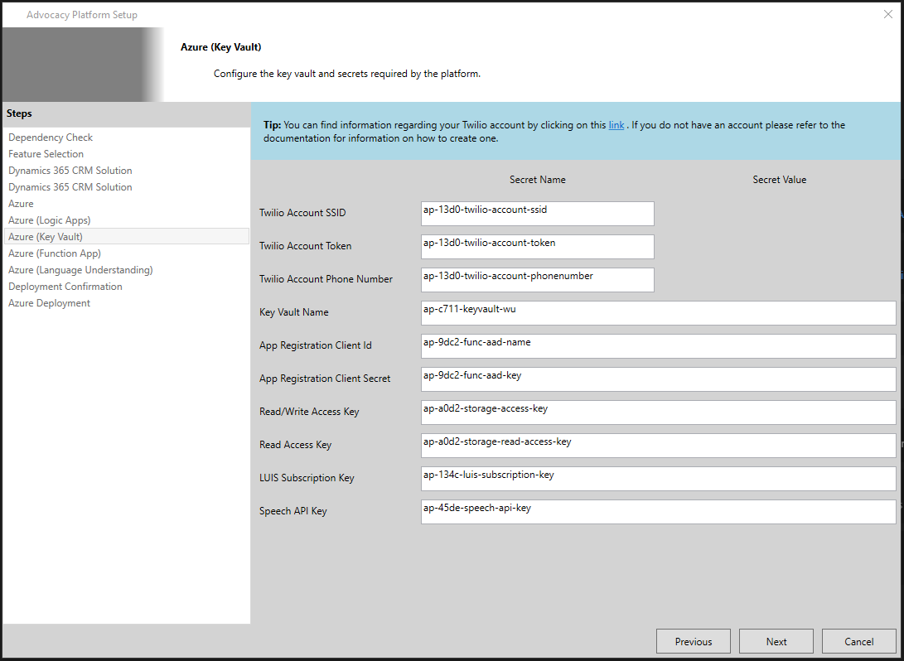

### VIII. Azure Function App
The necessary information needed to make updates to the Azure Function App required by the Advocacy Platform solution should reflect the values from your loaded installation configuration. Review the configuration values specified below, make any changes necessary, and click on the **Next** button to continue.

#### Configuration
|Configuration Value|Description|
|-|-|
|App Registration Name|The name of the application to register with Azure Active Directory.|
|App Name|The name of the Azure Function App resource to create.|
|App Service Name|The name of the Azure App Service resource to create representing the resources available to the Azure Function App resource.|
|App Deployment Source URL|A URL specifying the location of the latest Advocacy Platform Function App. You shouldn't have to change this.|

 
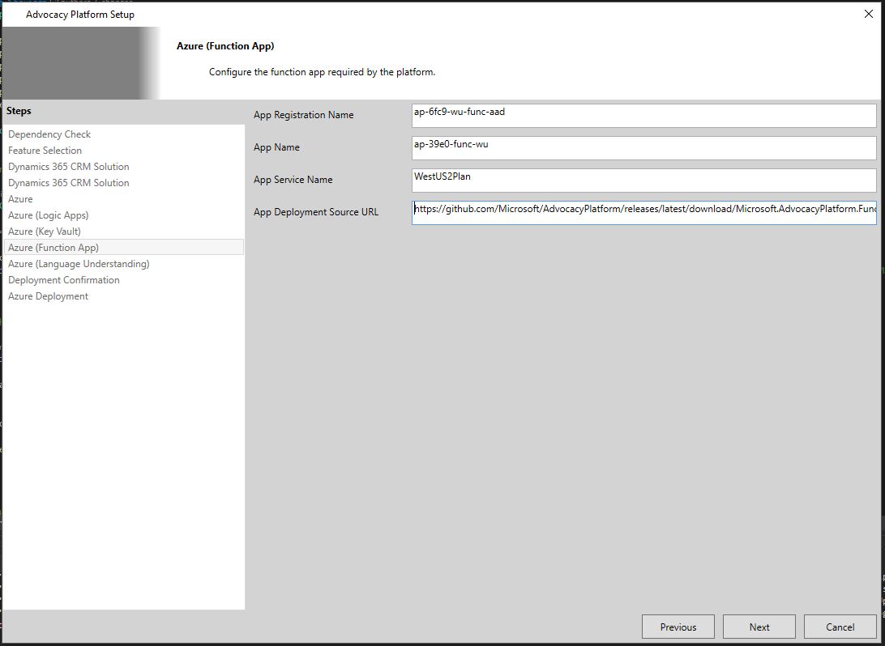

### IX. LUIS Model
The necessary information needed to make updates to the LUIS application required by the Advocacy Platform solution should reflect the values from your loaded installation configuration. Review the configuration values specified below, make any changes necessary, and click on the **Next** button to continue.

#### Configuration
|Configuration Value|Description|
|-|-|
|Resource Name|The name of the Azure LUIS Cognitive Service resource to create.|
|Authoring Key|The authoring key from your LUIS account needed to make calls to the LUIS Authoring API.|
|App Name|The name of the LUIS application to create.|
|App Version|The version of the LUIS application to create.|
|App File Path|The local file path to the LUIS application model definitions. You shouldn't have to change this.|
|Authoring Region|The name of the region your LUIS account is located.|
|Resource Region|The name of the region the Azure LUIS Cognitive Service resource was deployed to.|

 
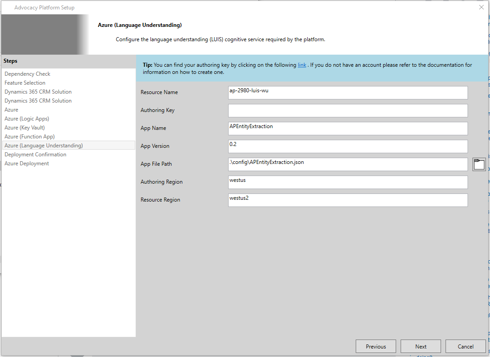

### X. Azure Deployment Validation
Before the deployment of updates required by the Advocacy Platform begins, the installer will present all of the updates to deploy and validate the configuration information is valid. If the configuration information is valid, the installer will automatically navigate to the next page and begin the update process.

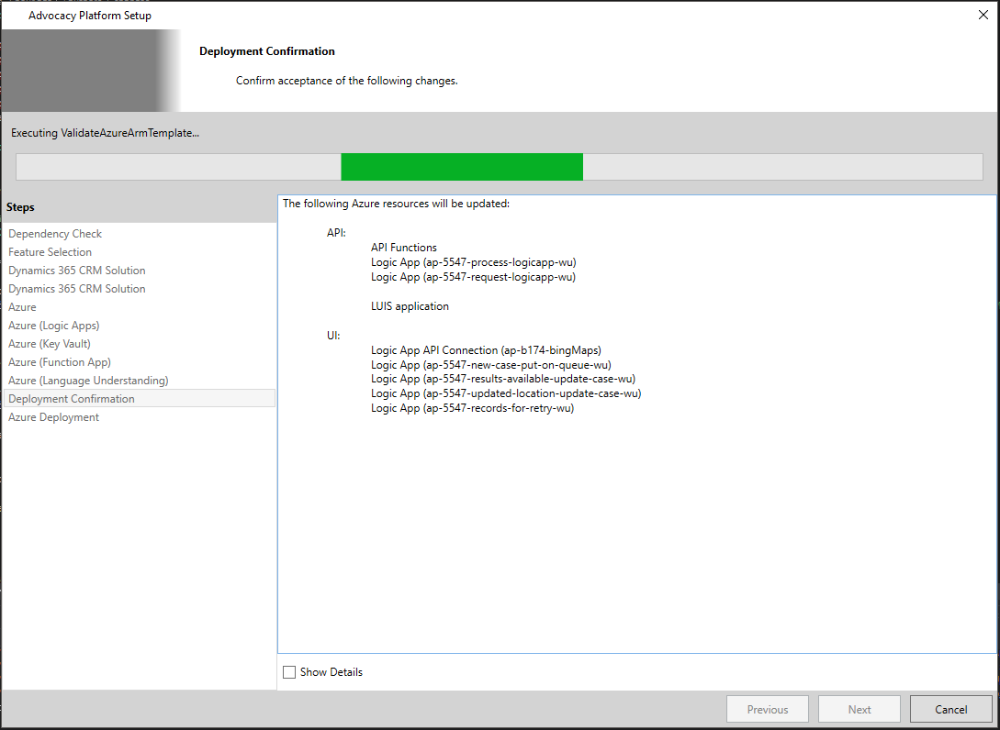
 
 

### X. Azure Deployment
Now you just need to sit back and wait for the deployment to complete. If any errors occur, they will be visible in the output log in the middle-right of the installation wizard. After the installation completes, the installer will automatically navigate to the final page.

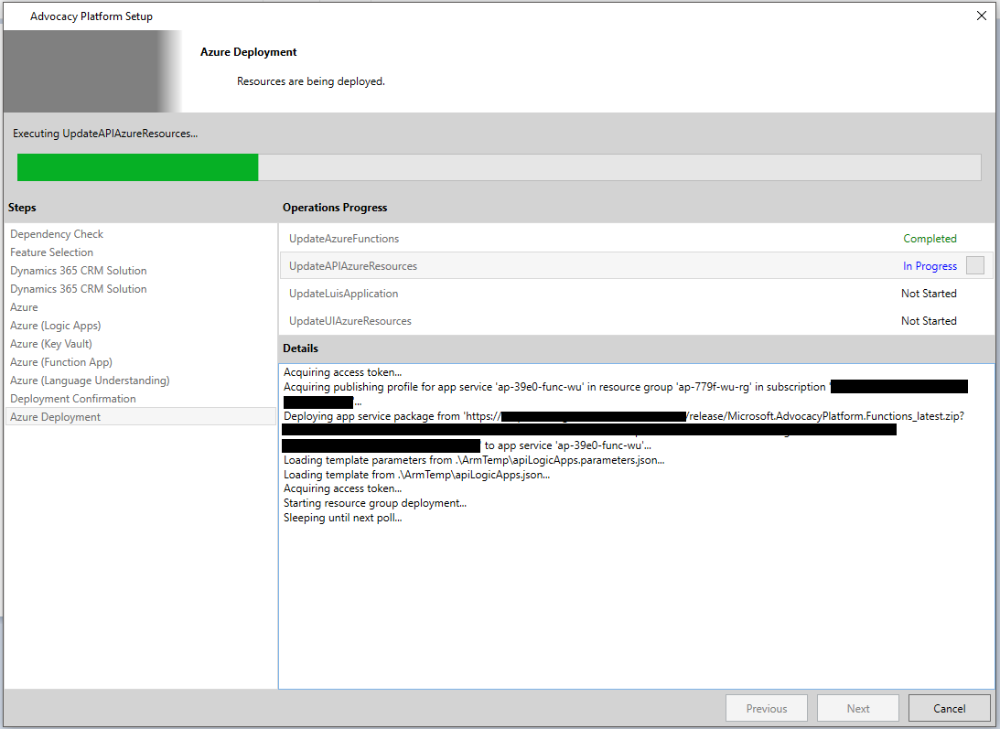

### XI. Update Completed
The final page of the installer will let you know if the update was successful or not. 

If the update was successful, the text directly under **"Advocacy Platform updated successfully."** provides a link to your updated Advocacy Platform solution. Click this link to open in your default browser.

Additionally, the last bit of text provides a link to allow you to save your installation configuration. This file is necessary for pushing updates or removing the platform completely.

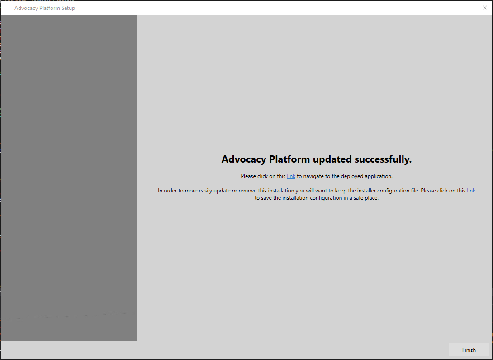

### XII. Validate Update
Please refer to the [Installation Validation]() guide for more information on how to validate an updated installation.
