# Install to a New Environment

**_Note:_** To view additional information regarding ongoing operations at any time click on the checkbox next to **Show Details** in the lower left corner.

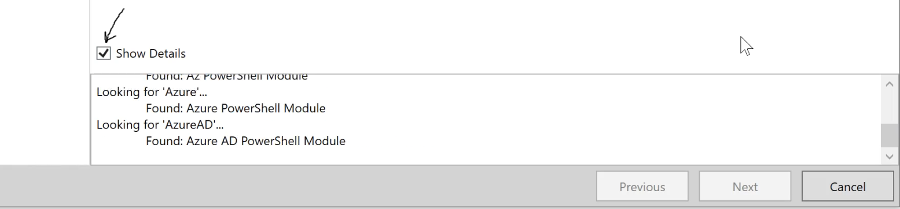

### I. Dependencies
#### Checking for Dependencies
In order to connect to and interact with the required Microsoft services, the installer needs to have consent for the indicated API permissions granted for the application in your tenant. One of the actions taken by the installer, registering the Function App application with Azure AD, needs an API permission requiring tenant administrator consent. If you are not a tenant administrator please forward the link on this page to your tenant administrator and ask for the application to be granted consent for the indicated API permissions. If you have not granted consent to this application before, click on *this link* in the description to open a browser frame in the installer and response appropriately to the prompts.

If you have previously granted consent, click on the **Next** button and continue to [Feature Selection](#II.-Feature-Selection)

 
 

Click on the **Accept** button.

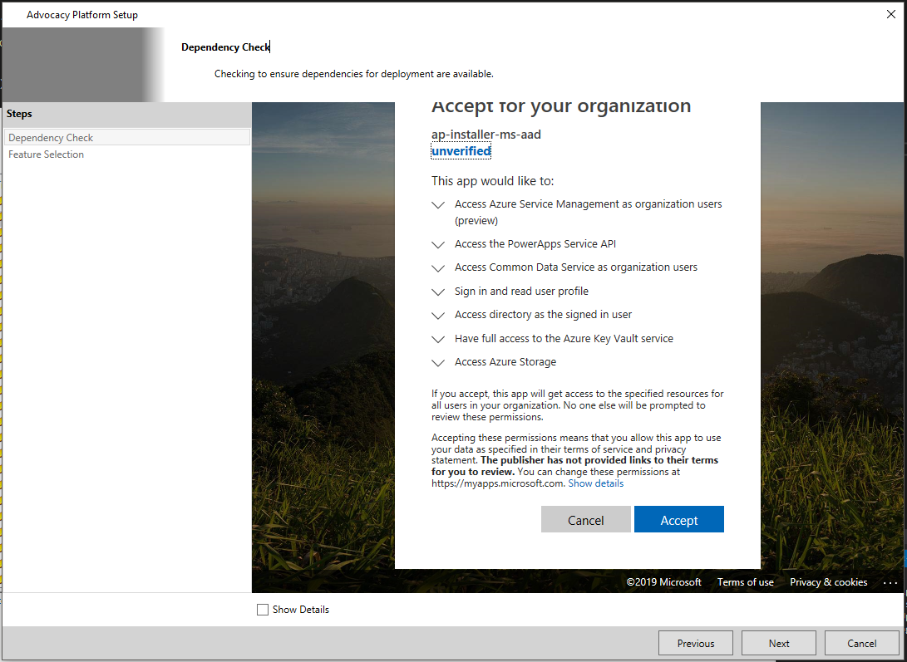

The wizard should automatically navigate to the next screen. If you encounter any issues, share the resulting error message with your tenant administrator.

### II. Feature Selection

The **Feature Selection** page describes the components to deploy during the installation process. Generally, you will just want to leave all of the components selected for a new installation. Click on the **Next** button to continue.

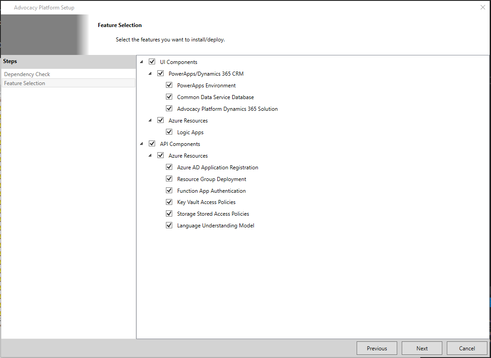

The following provides a description of each component:

|Root Component|Category|Component|Description|
|-|-|-|-|
|UI Components|PowerApps/Dynamics 365 CRM|PowerApps Environment|Deploys a new PowerApps environment|
|||Common Data Service Database|Deploys a new Common Data Services database|
|||Advocacy Platform Dynamics 365 Solution|Deploys the Advocacy Platform Customer Engagement package|
||Azure Resources|Logic Apps|Deploys logic apps used to monitor changes in the UI (Dynamics 365 CRM)|
|API Components|Azure Resources|Azure AD Application Registration|Creates a new application registration in Azure AD, creates a client secret, and creates a secret in the Azure Key Vault resource with the client secret.|
|||Resource Group Deployment|Deploys the majority of components required by the Advocacy Platform solution. Please refer to the [Azure Resources Manifest]() to see information regarding each resource.|
|||Function App Authentication|Assigns the application registration created to the deployed Azure Function App resource and configures requiring calls to the Function App to be authenticated with Azure AD.|
|||Key Vault Access Policies|Creates access policies in the deployed Azure Key Vault resource for the deploying user, the processing logic app, and the request logic app.|
|||Storage Shared Access Policies|Creates a read-write and read-only shared access policy, creates a shared access signature for both, and creates secrets in the Azure Key Vault with the values of each shared access signature.|
|||Language Understanding Model|Deploys, trains, and publishes the latest LUIS model.|

### III. PowerApps Environment and CDS Database
The Advocacy Platform uses a model-driven PowerApp to present it's UI to end users and stores information in a Common Data Services instance. Review the configuration values specified below, make any changes necessary, and click on the **Next** button to begin provisioning.

#### Configuration
|Configuration Value|Description|Default|
|-|-|-|
|Location|The location for the new PowerApps environment.|unitedstates|
|SKU|The environment SKU for the new PowerApps environment.|production|
|Display Name|The display name for the new PowerApps environment.|Randomized value based on template|
|CDS Currency|The currency symbol to use in the new Common Data Services database.||
|CDS Language|The language to use in the new Common Data Services database.||
|Deployment Region|The deployment region for the new Dynamics 365 CRM organization.|NorthAmerica|

 
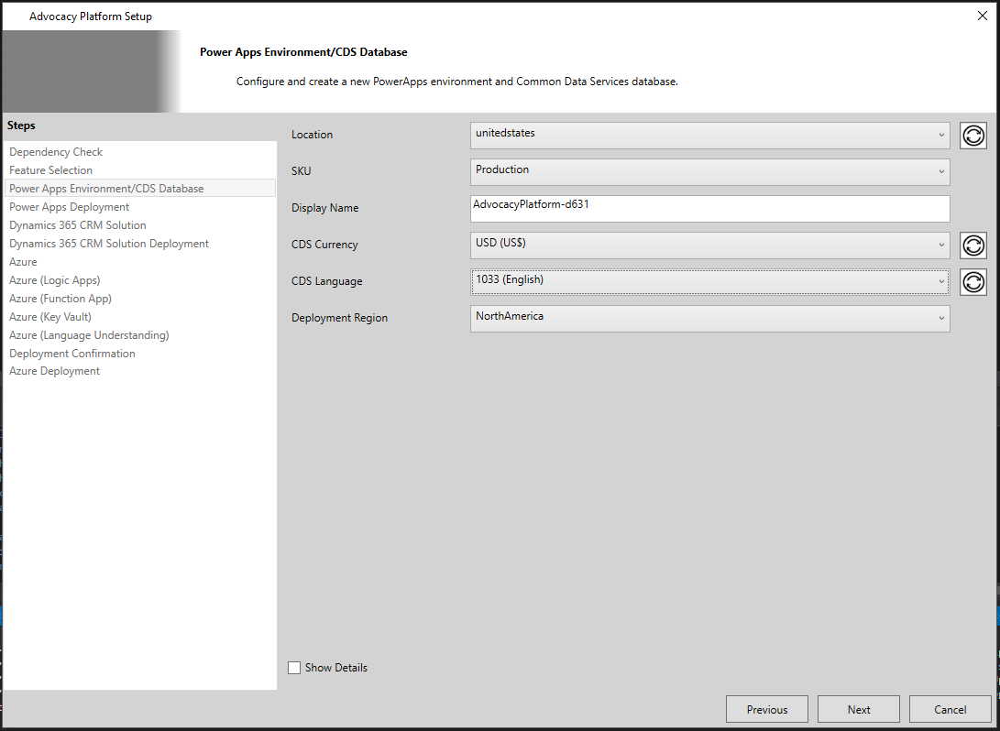

#### Deployment

The installer will begin the process of provisioning a new PowerApps environment and Common Data Services database. The installer will provided information regarding the progress of the provisioning process. As soon as the process has completed the wizard will automatically navigate to the next page.

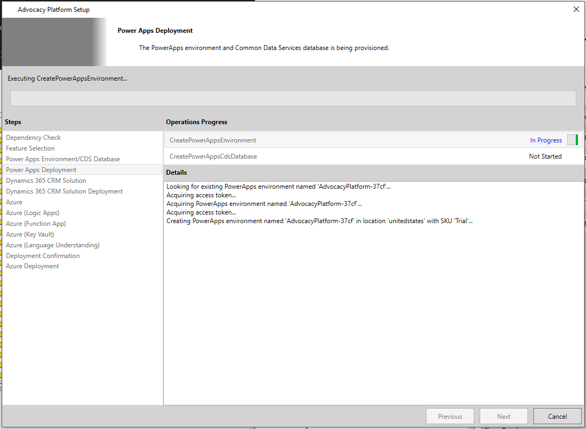

### IV. Dynamics 365 CRM Organization \ Solution
After the PowerApps environment and Common Data Services database has been provisioned a new Dynamics 365 CRM organization needs to be created. Review the configuration values specified below, make any changes necessary, and click on the **Next** button to begin provisioning.

#### Configuration
|Configuration Value|Description|Default|
|-|-|-|
|Deployment Region|The deployment region for the new Dynamics 365 CRM organization.|NorthAmerica|
|Organization Name|The unique name of the organization.||
|Solution Zip File Path|The local file path to the Advocacy Platform Dynamics 365 CRM solution package archive. You shouldn't have to change this.|.\AdvocacyPlatformSolution\AdvocacyPlatformSolution\AdvocacyPlatformSolution_managed.zip|
|Configuration Zip File Path|The local file path to the configuration data to import when deploying the Advocacy Platform solution. You shouldn't have to change this.|.\AdvocacyPlatformSolution\AdvocacyPlatformSolution\APConfigurationData.zip|

 
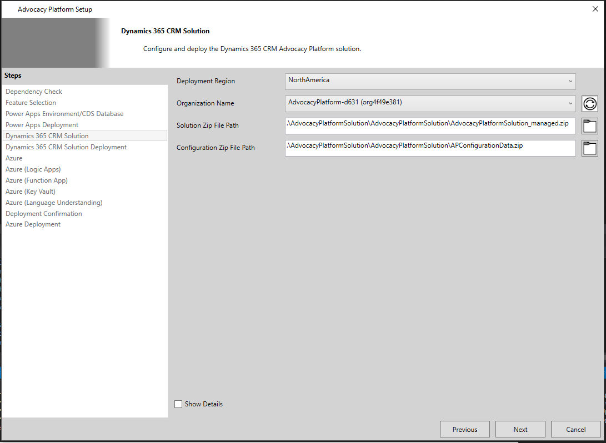

#### Deployment

The installer will deploy the specified Dynamics 365 CRM solution and configuration data. As soon as the deployment has completed the installer will automatically navigate to the next page.

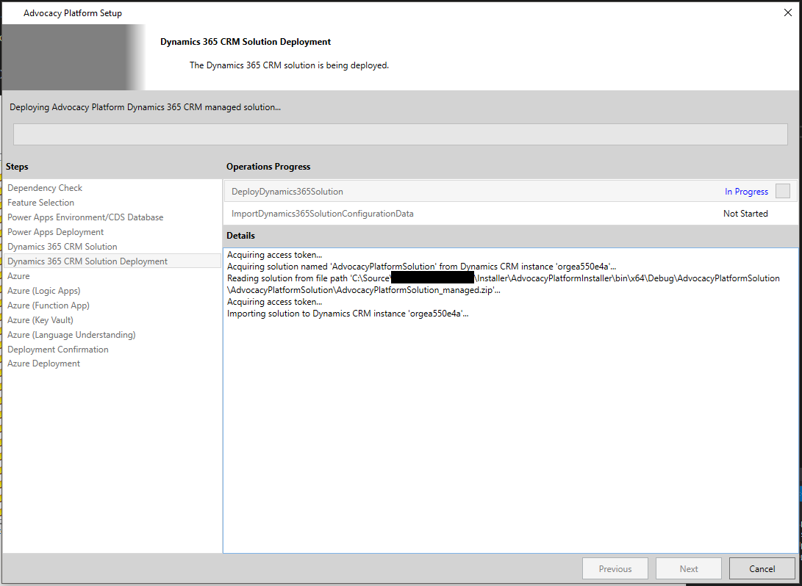

### V. Azure Resources
The Advocacy Platform solution is comprised of many different Azure services working together. On this page you will need to configure the names of these resources. Review the configuration values specified below, make any changes necessary, and click on the **Next** button to continue.

#### Configuration
|Configuration Value|Description|Default|
|-|-|-|
|Subscription|The Azure subscription to deploy resources to.||
|Resource Group Name|The name of the Azure resource group to create and deploy resources to.|Randomized value based on template|
|Storage Account Name|The name of the Azure Storage Account resource to create.|Randomized value based on template|
Service Bus Name|The name of the Azure Service Bus resource to create.|Randomized value based on template|
|Speech Resource Name|The name of the Azure Speech Cognitive Services resource to create.|Randomized value based on template|
|Log Analytics Name|The name of the Azure Log Analytics resource to create.|Randomized value based on template|
|App Insights Name|The name of the Azure Application Insights resource to create.|Randomized value based on template|

 
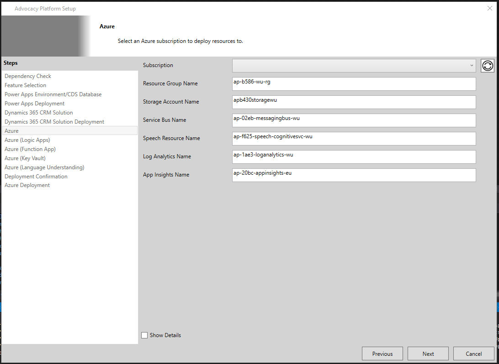

### VI. Azure Logic Apps
The Advocacy Platform uses Azure Logic Apps to coordinate the communication and orchestration of processes. On this page you will need provide configuration information specifying the names for the Azure Logic App resources and associated data connectors. Review the configuration values specified below, make any changes necessary, and click on the **Next** button to continue.

#### Configuration
|Configuration Value|Description|Default|
|-|-|-|
|Bing Maps API Key|The API key from your Bing Maps account needed to allow the Bing Maps data connector to resolve address queries.||
|Service Bus Connection Name|The name of the Azure Service Bus data connection resource to create to allow logic apps to read and write messages to and from the service bus resource.|Randomized value based on template|
|Common Data Service Connection Name|The name of the Common Data Services data connection resource to create to allow logic apps to read and write data to and from the Common Data Service database.|Randomized value based on template|
|Request Workflow Name|The name of the Azure Logic Apps resource to create to handle request messages.|Randomized value based on template|
|Process Workflow Name|The name of the Azure Logic Apps resource to create to handle processing messages.|Randomized value based on template|
|New Case Workflow Name|The name of the Azure Logic Apps resource to create to handle when new cases are created in Dynamics 365 CRM.|Randomized value based on template|
|Results Update Case Workflow Name|The name of the Azure Logic Apps resource to create to handle when process complete and case results should be updated.|Randomized value based on template|
|Address Update Case Workflow Name|The name of the Azure Logic Apps resource to create to handle when address resolution from Bing Maps completes and case results should be updated.|Randomized value based on template|
|Get Retry Records Workflow Name|The name of the Azure Logic Apps resource to create to handle the retry strategy for failures within the process.|Randomized value based on template|

 
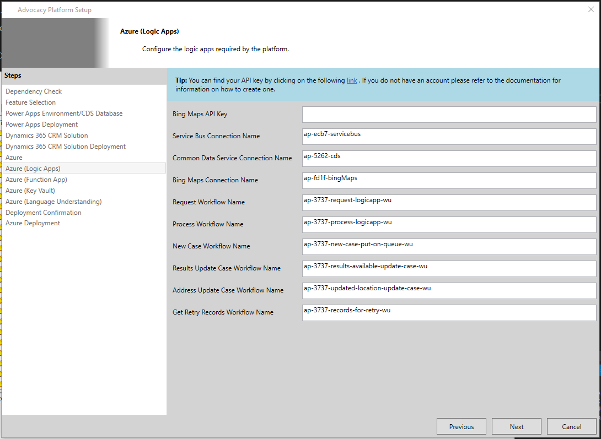

### VII. Azure Function App
The Advocacy Platform uses an Azure Function App to provide the functionality of making calls, copying recordings, transcribing calls, and extracting information on a consumption pricing model. On this page you will need provide configuration information for the Azure Function App resource and it's dependencies. Review the configuration values specified below, make any changes necessary, and click on the **Next** button to continue.

#### Configuration
|Configuration Value|Description|Default|
|-|-|-|
|App Registration Name|The name of the application to register with Azure Active Directory.|Randomized value based on template|
|App Registration Secret|A client secret to create for the service principal created from this application registration.|Randomized value using [System.Web.Security.GeneratePassword](https://docs.microsoft.com/en-us/dotnet/api/system.web.security.membership.generatepassword?redirectedfrom=MSDN&view=netframework-4.8#System_Web_Security_Membership_GeneratePassword_System_Int32_System_Int32_).
|App Name|The name of the Azure Function App resource to create.|Randomized value based on template|
|App Service Name|The name of the Azure App Service resource to create representing the resources available to the Azure Function App resource.|WestUS2Plan|
|App Deployment Source URL|A URL specifying the location of the latest Advocacy Platform Function App. You shouldn't have to change this.||

 
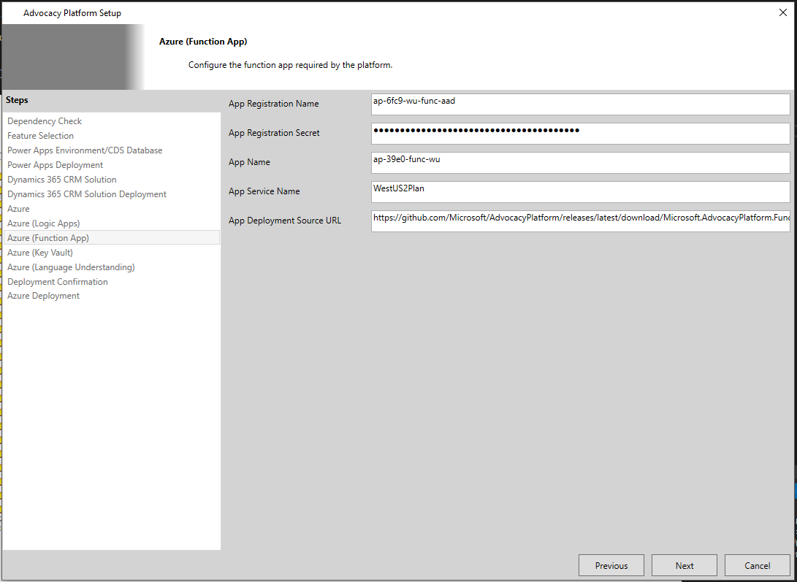

### VIII. Azure Key Vault Secrets
The Advocacy Platform ensures the confidentially of all secret values by ensuring all are stored in an Azure Key Vault resource. On this page you will need provide configuration information specifying the names for all of the known secrets. Review the configuration values specified below, make any changes necessary, and click on the **Next** button to continue.

#### Configuration
|Configuration Value|Description|Default|
|-|-|-|
|Twilio Account SSID|The name of the secret containing the SSID of your Twilio Account. You also need to populate the value under the **Secret Value** field with the actual SSID.|The secret name is a randomized value based on a template|
|Twilio Account Token|The name of the secret containing the token need to connect to your Twilio Account. You also need to populate the value under the **Secret Value** field with the actual token.|The secret name is a randomized value based on a template.|
|Twilio Account Phone Number|The name of the secret containing the phone number used to make calls from your Twilio Account. You also need to populate the value under the **Secret Value** field with the actual phone number.|The secret name is a randomized value based on a template.|
|Key Vault Name|The name of the Azure Key Vault resource to create.|Randomized value based on template|
|App Registration Client Id|The name of the secret containing the client id for the service principal used by the logic apps.|Randomized value based on template|
|App Registration Client Secret|The name of the secret containing the client secret for the service principal used by the logic apps.|Randomized value based on template|
|Read/Write Access Key|The name of the secret containing the read-write shared access signature used by the Function App to copy call recordings from Twilio to Azure Blob Storage.|Randomized value based on template|
|Read Access Key|The name of the secret containing the read shared access signature used by the model-drive PowerApp to allow access to call recordings in Azure Blob Storage.|Randomized value based on template|
|LUIS Subscription Key|The name of the secret containing the LUIS subscription key used by the Function App to extract information from transcribed called.|Randomized value based on template|
|Speech API Key|The name of the secret containing the Azure Speech Cognitive Services API key used by the Function App to transcribe call recordings.|Randomized value based on template|

 
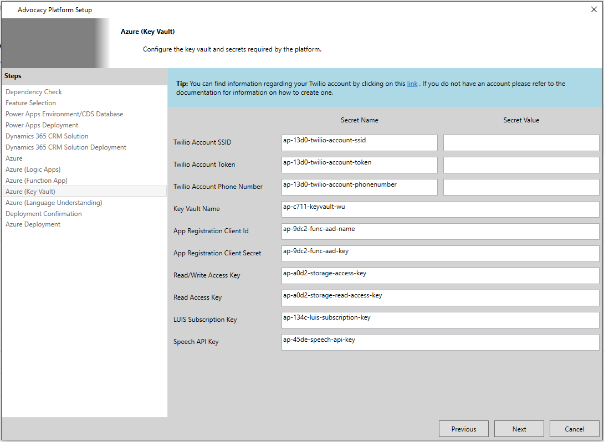

### IX. LUIS Model
The Advocacy Platform uses the Language Understanding Intelligent Service (LUIS) to extract information from transcribed call recordings. On this page you will need provide configuration information for the LUIS application to deploy. Review the configuration values specified below, make any changes necessary, and click on the **Next** button to continue.

#### Configuration
|Configuration Value|Description|Default|
|-|-|-|
|Resource Name|The name of the Azure LUIS Cognitive Service resource to create.|Randomized value based on template|
|Authoring Key|The authoring key from your LUIS account needed to make calls to the LUIS Authoring API.||
|App Name|The name of the LUIS application to create.|APEntityExtraction|
|App Version|The version of the LUIS application to create.|0.2|
|App File Path|The local file path to the LUIS application model definitions. You shouldn't have to change this.|.\config\APEntityExtraction.json|
|Authoring Region|The name of the region your LUIS account is located.|westus|
|Resource Region|The name of the region the Azure LUIS Cognitive Service resource was deployed to.|westus2|

 
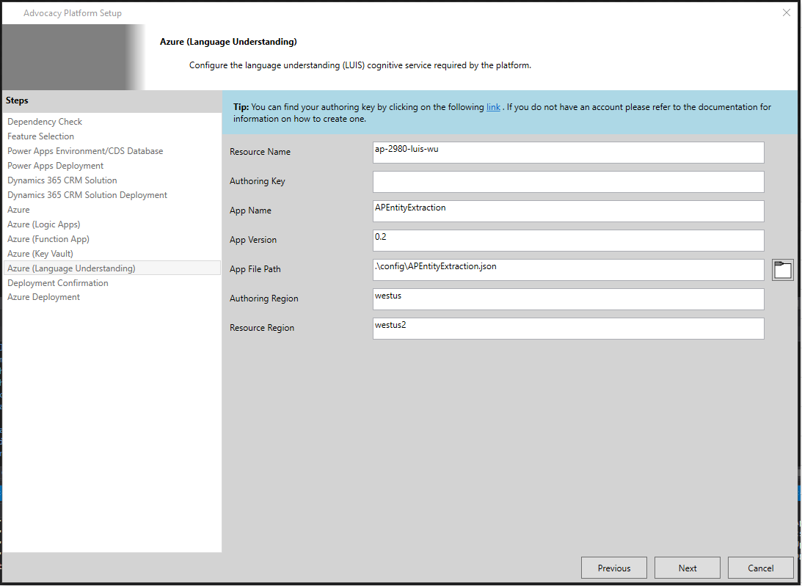

### X. Azure Deployment Validation
Before deployment of all of the resources required by the Advocacy Platform begins, the installer will present of all of the resources being created and validate the configuration information is valid. If the configuration information is valid, the installer will automatically navigate to the next page and begin deployment.

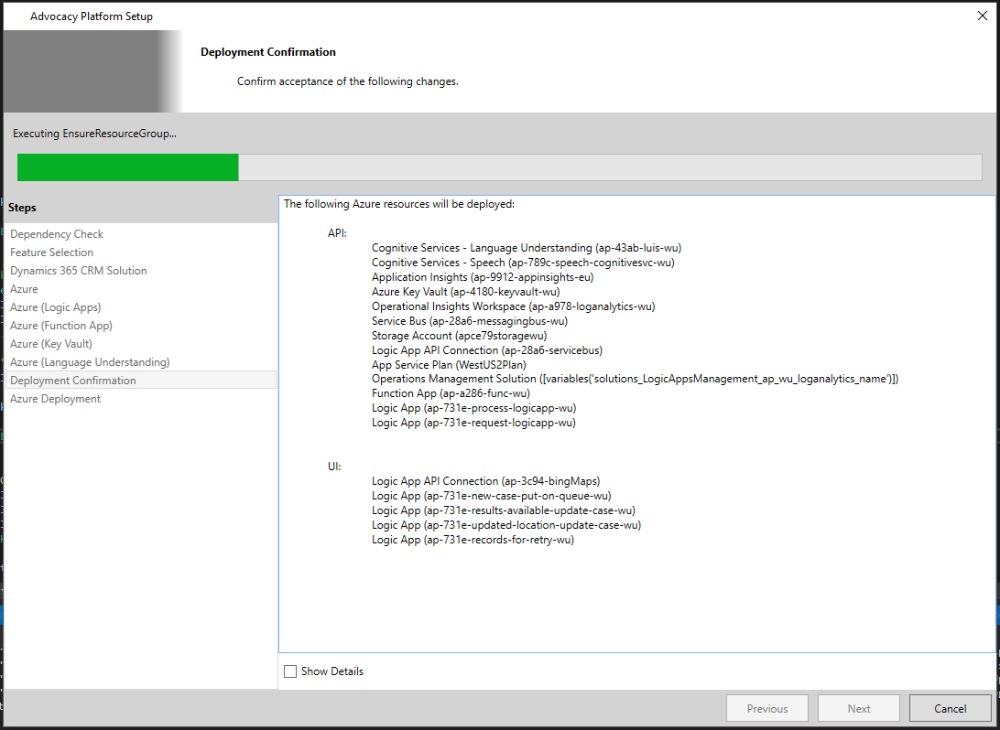
 
 
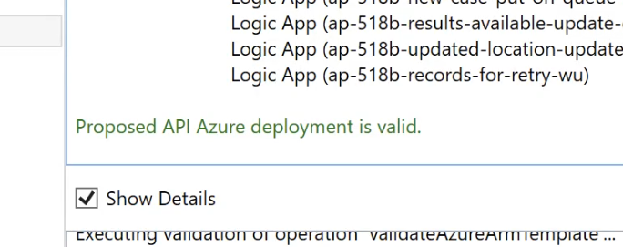

### XI. Azure Deployment
Now you just need to sit back and wait for the deployment to complete. If any errors occur, they will be visible in the output log in the middle-right of the installation wizard. After the installation completes, the installer will automatically navigate to the final page.

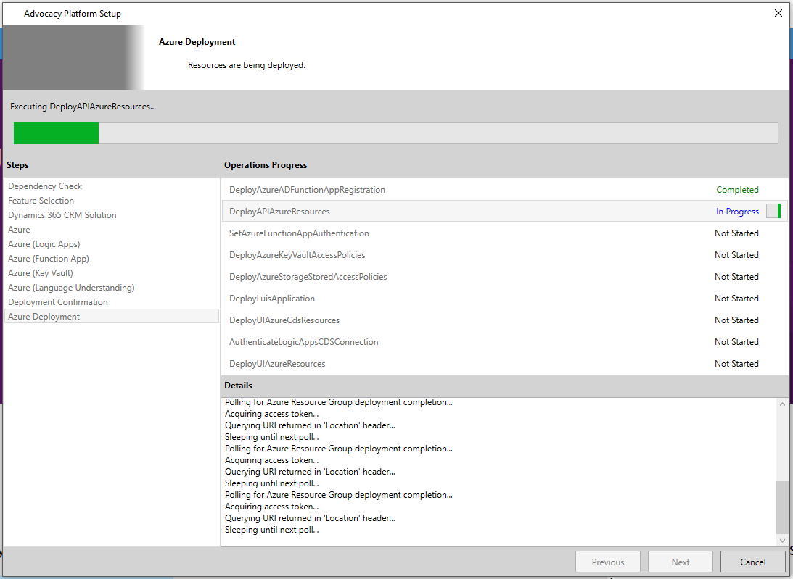

If you want, you can watch the deployment in the respective service portals as it completes. The following provides a few examples of monitoring an ongoing deployment:

#### Azure AD Application Registration
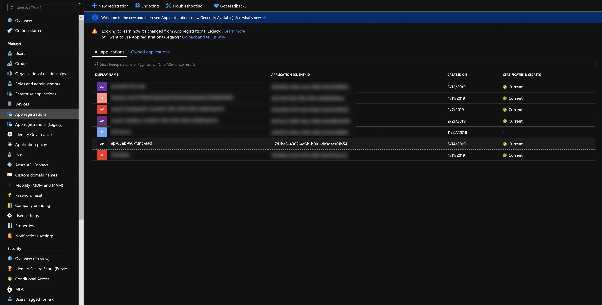

#### Azure Resource Group Deployment
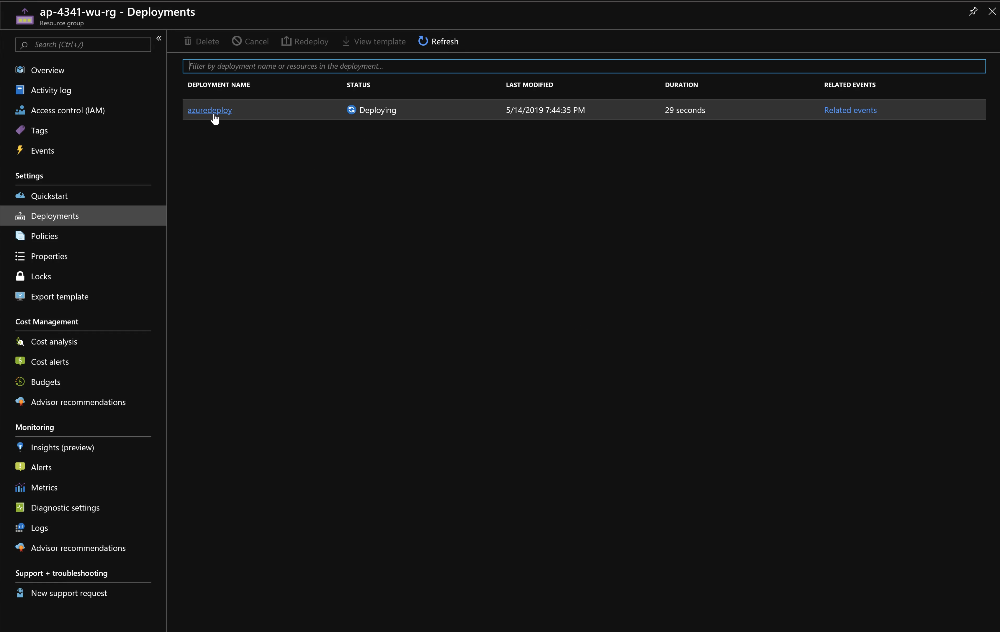
 
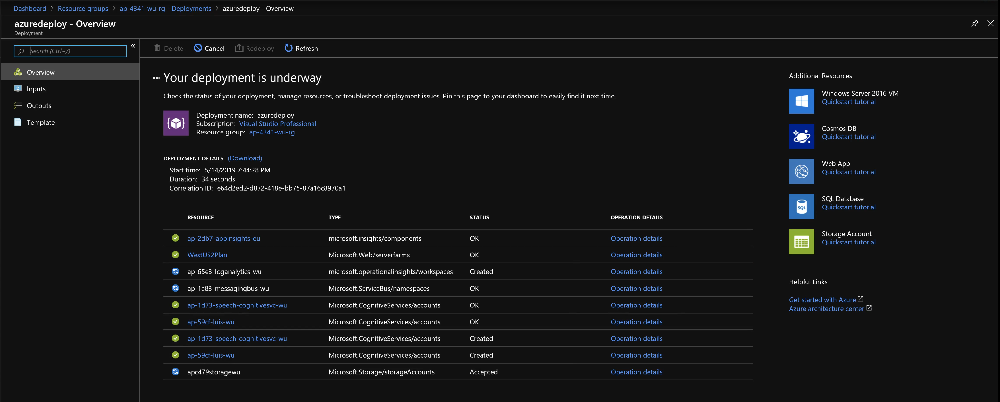

#### Azure LUIS Application Deployment

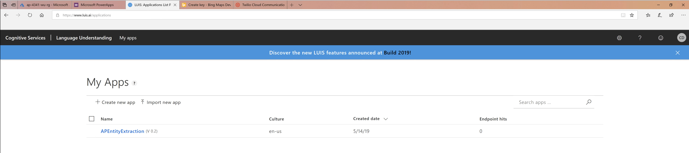

### XII. Installation Completed
The final page of the installer will let you know if the installation was successful or not. 

If the installation was successful, the text directly under **"Advocacy Platform installed successfully."** provides a link to your newly deployed Advocacy Platform solution. Click this link to open in your default browser.

Additionally, the last bit of text provides a link to allow you to save your installation configuration. This file is necessary for pushing updates or removing the platform completely.

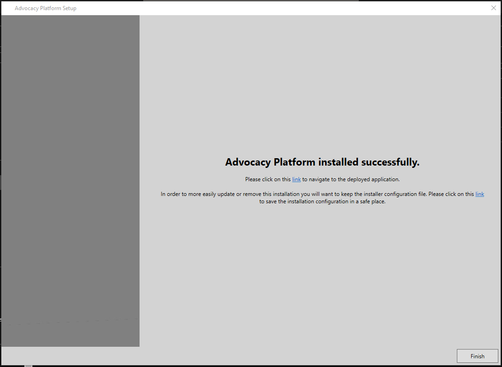

### XIII. Validate Installation
Please refer to the [Installation Validation](../installation-validation.md) guide for more information on how to validate a new installation.

