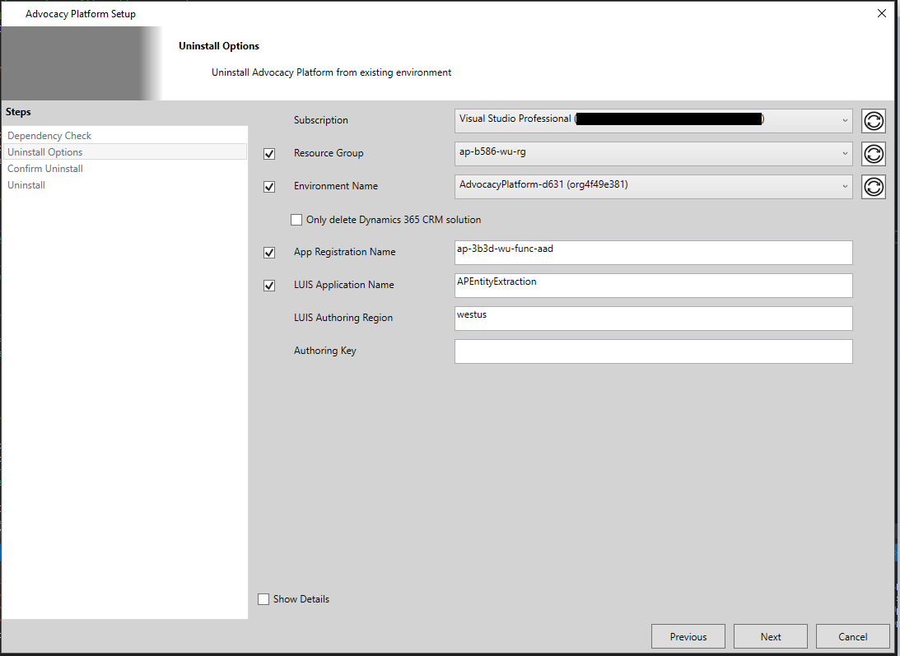
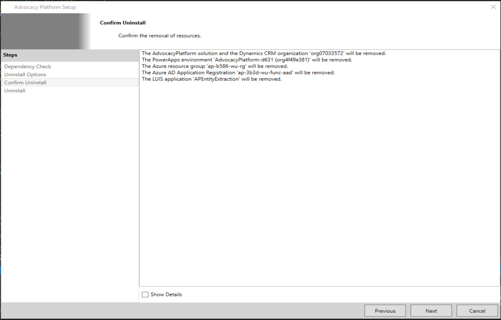
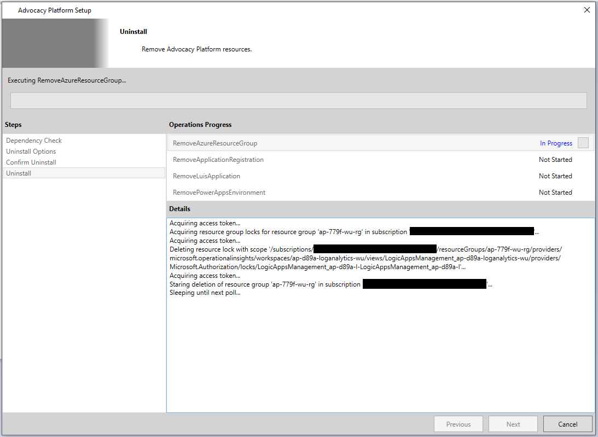
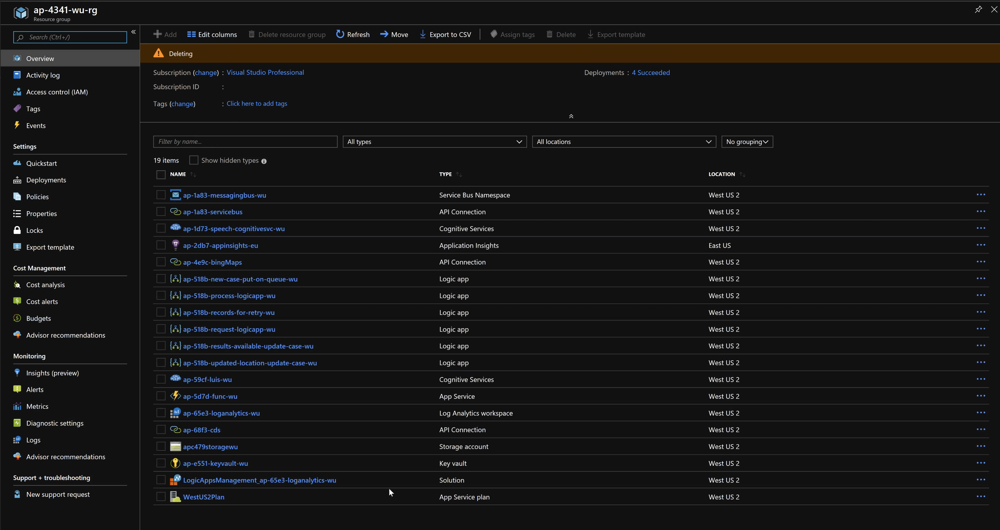
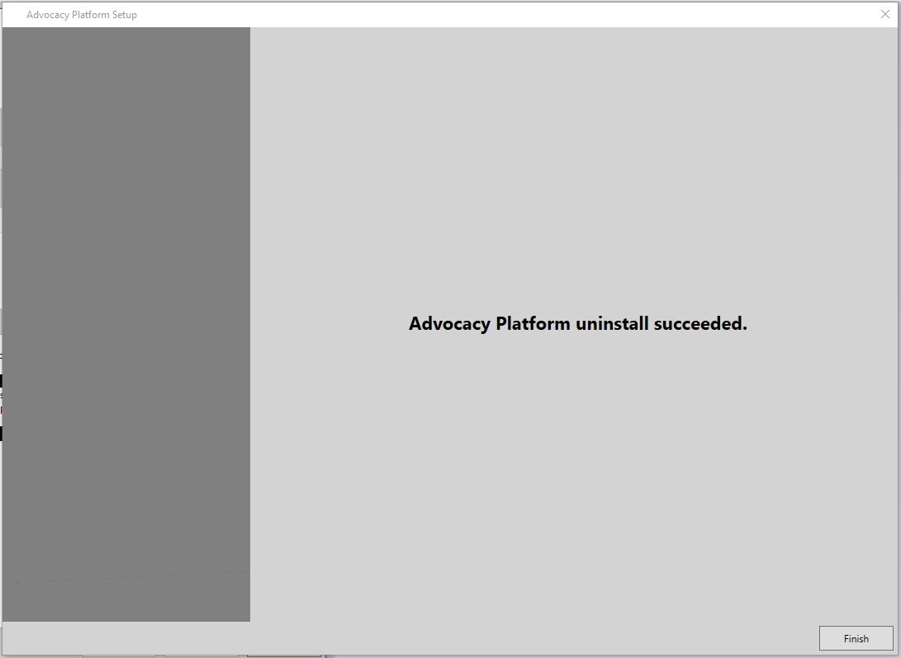
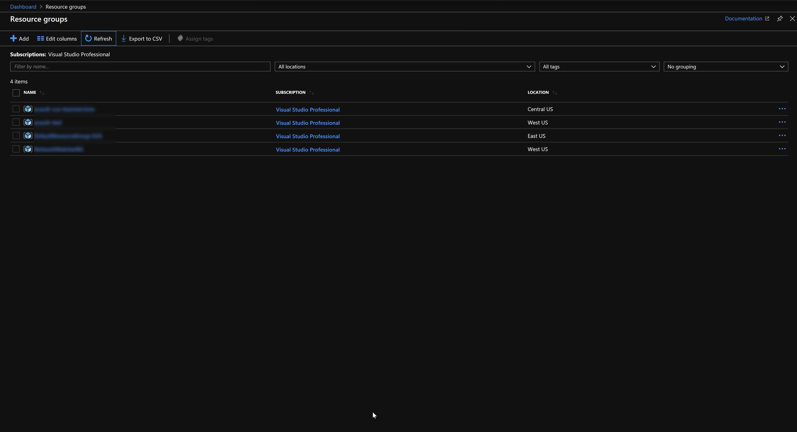
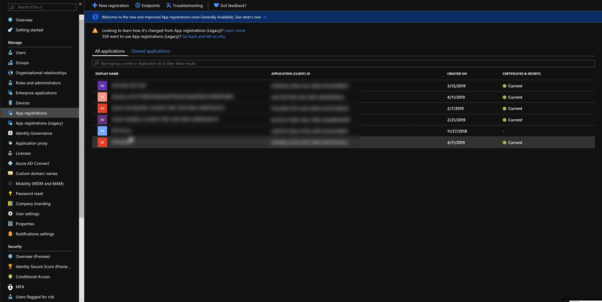
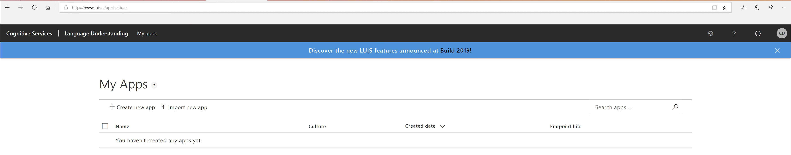
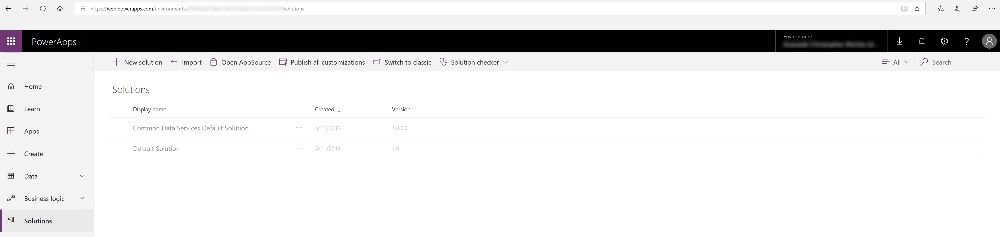

# Uninstall

**_Note:_** To view additional information regarding ongoing operations at any time click on the checkbox next to **Show Details** in the lower left corner.

### I. Dependencies
#### Checking for Dependencies
In order to connect to and interact with the required Microsoft services, the installer needs to have consent for the indicated API permissions granted for the application in your tenant. One of the actions taken by the installer, registering the Function App application with Azure AD, needs an API permission requiring tenant administrator consent. If you are not a tenant administrator please forward the link on this page to your tenant administrator and ask for the application to be granted consent for the indicated API permissions. If you have not granted consent to this application before, click on *this link* in the description to open a browser frame in the installer and response appropriately to the prompts.

If you have previously granted consent, click on the **Next** button and continue to [Feature Selection](#II.-Feature-Selection)

 
 

Click on the **Accept** button.

The wizard should automatically navigate to the next screen. If you encounter any issues, share the resulting error message with your tenant administrator.

### II. Components to Uninstall
The **Uninstall Options** page describes the components to uninstall. Select the components you want to uninstall (leave all selected to complete remove) and click on the **Next** button to continue.

|Component Name|Description|
|-|-|
|Subscription|This represent the subscription a resource group to remove exists in. **No Azure subscription is removed as a part of this process.**|
|Resource Group|The resource group to remove containing the Advocacy Platform components. **The entire resource group will be removed as part of this process.**|
|Environment Name|The Dynamics 365 CRM Organization, Common Data Services database, and PowerApps environment to remove.|
|App Registration Name|The application registration to remove from Azure Active Directory.|
|LUIS Application Name|The LUIS application to remove.|
|LUIS Authoring Region|The region of your LUIS account.|
|LUIS Authoring Key|The authoring key required to make calls to the LUIS Authoring API to remove the application.|

 

### III. Confirmation

Before component removal begins, the installer will present a list of all of the components being removed. If you consent to the removal of the listed components, click on the **Next** button to navigate to the next page and begin the removal process.

### III. Uninstalling
Now you just need to sit back and wait for the removal process to complete. If any errors occur, they will be visible in the output log in the middle-right of the installation wizard. After the removal process completes, the installer will automatically navigate to the final page.

 
 

### IV. Uninstall Completed
The final page of the installer will let you know if the removal process was successful or not.

If the removal process was successful, please delete your saved installation configuration file as it will no longer be valid.

### V. Uninstallation Validation
To validate the removal process, you will want to navigate to the respective service portals for each of these components and ensure they no longer exits.

#### Azure
The Azure resource group should no longer exist in your Azure subscription.

#### Azure AD Application Registration
The application registration should no longer exist in Azure Active Directory for your tenant.

#### LUIS Application
The LUIS application should no longer exist in your LUIS account.

#### Power Apps Environment\Common Data Services Database\Dynamics 365 CRM Organization
The Dynamics 365 CRM Organization, Common Data Services database, and PowerApps environment should no longer exist.

