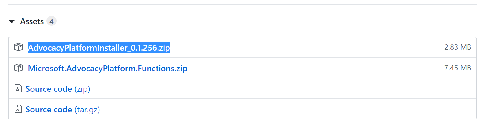
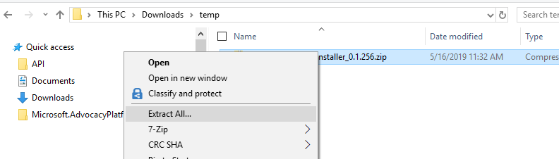
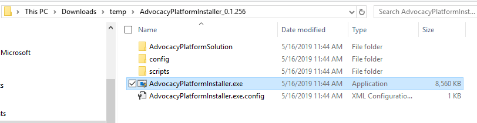
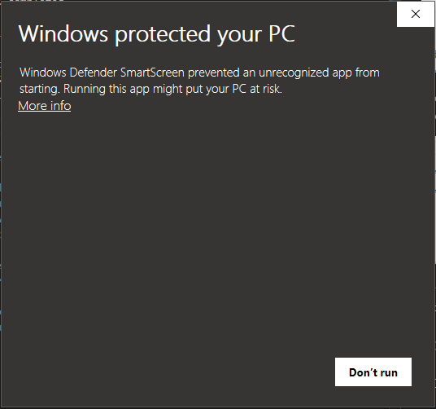
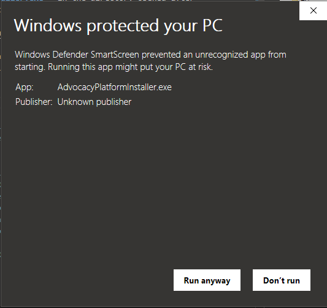
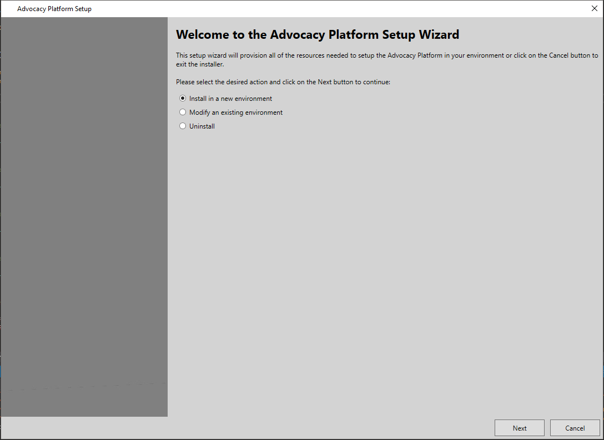

# Installer
## Pre-requisites
Before running the Advocacy Platform installer you should ensure you have all required accounts setup. Please refer to the following links for more information.

1. [PowerApps Plan](../prerequisites/powerapps-plan.md)
1. [Azure Subscription](../prerequisites/azure-subscription.md)
1. [Twilio Account](../prerequisites/twilio-account.md)
1. [Bing Maps Account](../prerequisites/bing-maps-account.md)
1. [LUIS Account](../prerequisites/luis-account.md)

## Download and Extract Installer
Begin by navigating to the latest Advocacy Platform GitHub release at https://github.com/Microsoft/AdvocacyPlatform/releases/latest. Download the latest version of the installer by clicking on the asset named AdvocacyPlatformInstaller_{version}.zip.

Once the download has completed navigate ot the download archive and extract all of the contents.

Open the extractor by double-clicking on **AdvocacyPlatformInstaller.exe** in the directory opened after extraction has completed.

Until the installer has been downloaded and executed enough times Windows SmartScreen will show a dialog asking if it is OK to run this executable.

Click on **More info**.

Click on the **Run anyway** button.

## Step-by-Step Installer Guide
### I. Choose Installer Action
The **Welcome** page of the installer will prompt you to select the desired installer action. Click on the radio button next to the text for the desired action.

For new installations, ensure the *Install in a new environment* radio button is selected and continue to the [New Installation](./actions/new-installation.md) guide.

To update an existing installation, ensure the *Modify an existing environment* radio button is selected and continue to the [Modify Installation](./actions/modify-installation.md) guide.

To remove an existing installation, ensure the *Uninstall* radio button is selected and continue to the [Uninstall](./actions/uninstall-installation.md) guide.

## Known Issues and Resolutions
Currently no known issues
