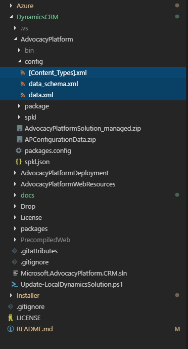

# Configuration Data
The following provides instructions on how to export configuration data and integrate into the existing source tree.

## Download Data Migration Tool
Follow the instructions at https://docs.microsoft.com/en-us/dynamics365/customer-engagement/developer/download-tools-nuget to download the Dynamics 365 CRM Data Migration tool.

## Export Configuration Data
Follow the instructions at https://docs.microsoft.com/en-us/dynamics365/customer-engagement/admin/manage-configuration-data to export configuration data from a development Dynamics 365 CRM Customer Engagement solution.

## Replace in Source Tree
Extract the resulting archive and copy the files to the following location in the source tree:

### Checking in Changes
Please refer to the [Checking in Changes](../contributing/checking-in-changes.md) guide for more information on the preferred process for integrating changes.